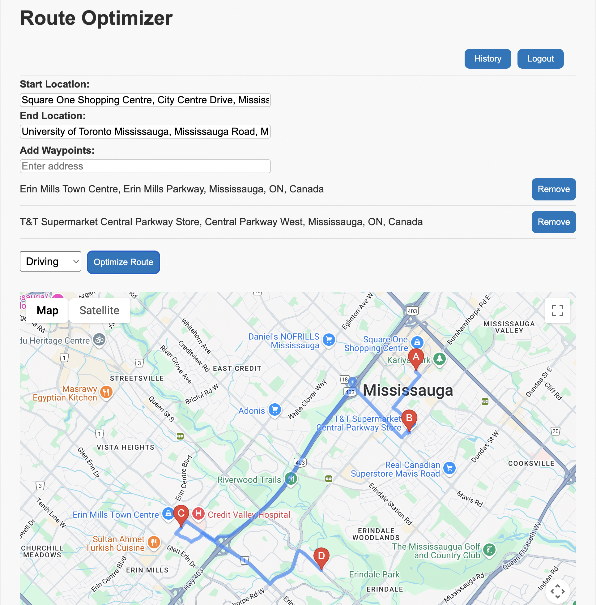

# 🗺️ Route Optimizer

A web-based routing application that helps users optimize travel routes by calculating the most efficient path between multiple waypoints using the Google Maps Directions API. Built with React, Vite, and the Google Maps JavaScript SDK.

---

## 🚀 Features

- 📍 Autocomplete input for Start, End, and Waypoints
- 🔁 Optimized route calculation
- 🗺️ Interactive Google Map display
- 🧠 Debounced address search to reduce API calls
- ➕ Add/remove waypoints dynamically
- 📦 Built with Vite + React + Google Maps API

---

## 📸 Demo

---

## 🧰 Tech Stack

- [React](https://react.dev/)
- [Vite](https://vitejs.dev/)
- [Google Maps JavaScript API](https://developers.google.com/maps/documentation/javascript/overview)
- [Google Places API](https://developers.google.com/maps/documentation/places/web-service/overview)
- [Lodash.debounce](https://lodash.com/docs/4.17.15#debounce)
