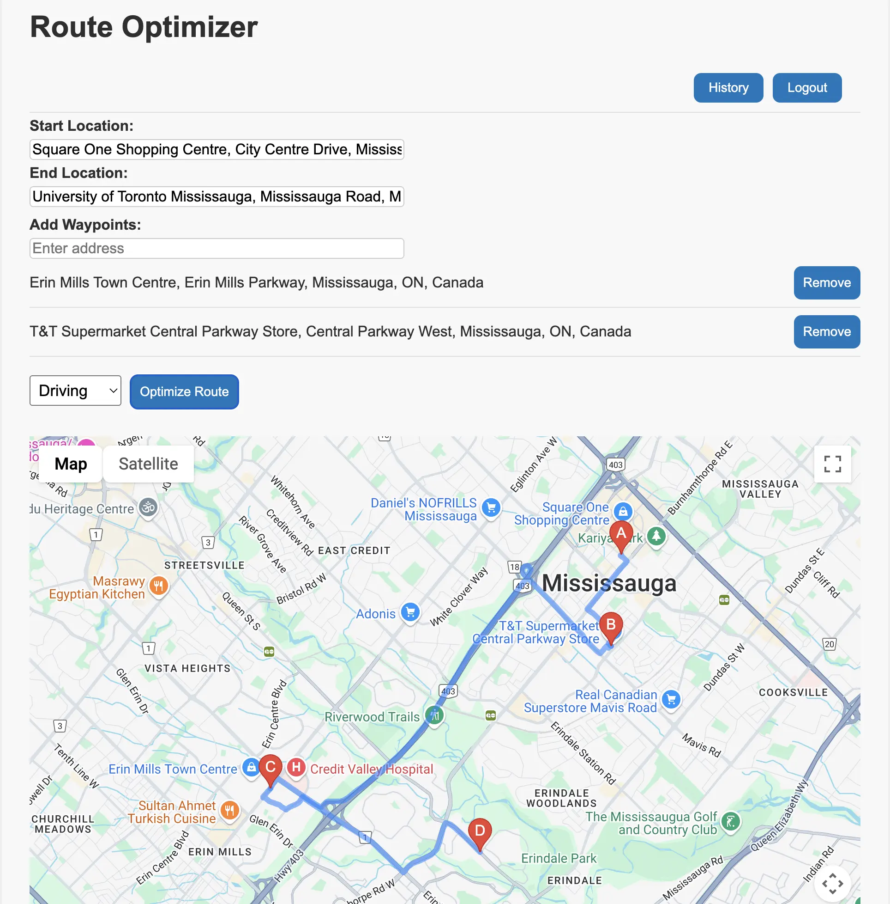

# 🗺️ Route Optimizer

A web-based routing application that helps users optimize travel routes by calculating the most efficient path between multiple waypoints using the Google Maps Directions API. Built with React, Vite, and the Google Maps JavaScript SDK and Firebase Authentication and FireStore.

---

## 🚀 Features

- Autocomplete input for Start, End, and Waypoints
- Optimized route calculation
- Interactive Google Map display
- Debounced address search to reduce API calls
- Add/remove waypoints dynamically
- Built with Vite + React + Google Maps API
- Authentication with Firebase: Supports email/password login, and guest (anonymous) login so users can try the app without creating an account.
- Cloud Firestore Database: Saves each logged-in user’s past optimized routes in their private history collection, allowing them to view their 10 most recent routes anytime.

---

## 📸 Demo

---

## 🧰 Tech Stack

- [React](https://react.dev/)
- [Vite](https://vitejs.dev/)
- [Google Maps JavaScript API](https://developers.google.com/maps/documentation/javascript/overview)
- [Google Places API](https://developers.google.com/maps/documentation/places/web-service/overview)
- [Lodash.debounce](https://lodash.com/docs/4.17.15#debounce)
- [Firebase](https://firebase.google.com/)
